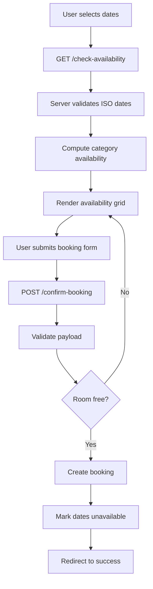

# Database Schema and Diagrams

Authoritative sources:
- Migrations: [rooms](database/migrations/2025_10_30_100057_create_rooms_table.php:1), [bookings](database/migrations/2025_10_30_100125_create_bookings_table.php:1), [room_categories](database/migrations/2025_10_30_110921_create_room_categories_table.php:1), [availabilities](database/migrations/2025_11_01_102311_create_availabilities_table.php:1)
- Models: [availability](app/Models/availability.php:11), [booking](app/Models/booking.php:9), [room](app/Models/room.php:8), [roomCategory](app/Models/roomCategory.php:9)

Notes: current schema uses string types for some FKs and amounts in migrations (e.g., bookings.room_id, total_price). Consider refactoring to numeric types and foreign keys in future revisions.

## ER Diagram

```mermaid
erDiagram
  ROOM_CATEGORIES ||--o{ ROOMS : has
  ROOMS ||--o{ BOOKINGS : has
  ROOMS ||--o{ AVAILABILITIES : has

  ROOM_CATEGORIES {
    BIGINT id PK
    STRING name UNIQUE
    STRING base_price
    TIMESTAMP timestamps
  }

  ROOMS {
    BIGINT id PK
    STRING room_category_id
    STRING room_number UNIQUE
    STRING status
    TIMESTAMP timestamps
  }

  BOOKINGS {
    BIGINT id PK
    STRING name
    STRING email UNIQUE
    STRING phone_number
    DATE check_in_date
    DATE check_out_date
    STRING room_id
    STRING total_price
    TIMESTAMP timestamps
  }

  AVAILABILITIES {
    BIGINT id PK
    BIGINT room_id FK
    DATE date
    BOOLEAN is_available
    TIMESTAMP timestamps
    UNIQUE room_id_date
  }
```

## Table Definitions

### room_categories
- id BIGINT PK
- name STRING UNIQUE
- base_price STRING
- created_at, updated_at TIMESTAMP

Source: [create_room_categories_table](database/migrations/2025_10_30_110921_create_room_categories_table.php:12)

### rooms
- id BIGINT PK
- room_category_id STRING
- room_number STRING UNIQUE
- status STRING
- created_at, updated_at TIMESTAMP

Source: [create_rooms_table](database/migrations/2025_10_30_100057_create_rooms_table.php:12)

### bookings
- id BIGINT PK
- name STRING
- email STRING UNIQUE
- phone_number STRING
- check_in_date DATE
- check_out_date DATE
- room_id STRING
- total_price STRING
- created_at, updated_at TIMESTAMP

Source: [create_bookings_table](database/migrations/2025_10_30_100125_create_bookings_table.php:12)

### availabilities
- id BIGINT PK
- room_id BIGINT FK → rooms.id (on delete cascade)
- date DATE
- is_available BOOLEAN DEFAULT true
- created_at, updated_at TIMESTAMP
- UNIQUE (room_id, date)

Source: [create_availabilities_table](database/migrations/2025_11_01_102311_create_availabilities_table.php:12)

## Relationships
- A roomCategory has many rooms.
- A room has many bookings.
- A room has many availability rows (per-day ledger).
- A day is considered unavailable for a room if an availability record exists with is_available=false on that date.

See: [availability::isAvailableForRange()](app/Models/availability.php:45), [availability::markAsBooked()](app/Models/availability.php:57)

## Booking Flow (sequence)



## Indexes and Constraints
- availabilities: UNIQUE (room_id, date)
- bookings: UNIQUE (email)
- rooms: UNIQUE (room_number)

## Recommendations (future migrations)
- Change rooms.room_category_id to foreignId with proper FK to room_categories.id.
- Change bookings.room_id to foreignId with FK to rooms.id.
- Change base_price and total_price to numeric (e.g., integer cents) for arithmetic safety.
- Add composite uniqueness as needed (e.g., (room_id, check_in_date, check_out_date) if suitable).

## Related Code
- [reservationController](app/Http/Controllers/reservationController.php:14)
- [availability](app/Models/availability.php:11)
- [booking](app/Models/booking.php:9)
- [room](app/Models/room.php:8)
- [roomCategory](app/Models/roomCategory.php:9)
